---?image=assets/images/crystal-logo.png&size=45% auto

---

- 資料は公開済みです
  - [https://gitpitch.com/at-grandpa/ruby-association-event-slides-20170706#](https://gitpitch.com/at-grandpa/ruby-association-event-slides-20170706#)
  - [@at_grandpa](https://twitter.com/at_grandpa)でつぶやきます
- 実況ツイートなど大歓迎です
- スライド中のリンクはクリックできます
  -  GitPitch便利

---

###### Matzさんの後で緊張しています🌀

---

## RubyKaigi 2016


###### [#rubyfriends](https://twitter.com/hashtag/rubyfriends?src=hash)  [#rubykaigi](https://twitter.com/hashtag/rubykaigi?src=hash)


---

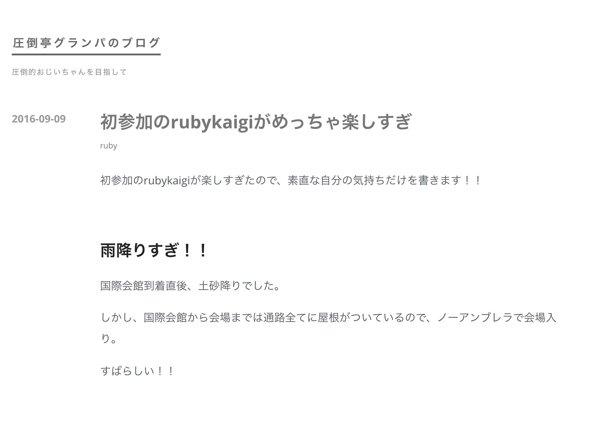

<span style="font-size: 30px;font-weight: 600;">[http://at-grandpa.hatenablog.jp/entry/2016/09/09/083547](http://at-grandpa.hatenablog.jp/entry/2016/09/09/083547)</span>


---

## 🎉 RubyKaigi 2017 ⛩


###### [http://rubykaigi.org/2017](http://rubykaigi.org/2017)


---


- twitter: [@at_grandpa](https://twitter.com/at_grandpa)
- github: [@at-grandpa](https://github.com/at-grandpa)
###### 　
###### I love Crystal lang.


---

## Crystal-lang [Google Group](https://groups.google.com/forum/?fromgroups#!forum/crystal-lang)

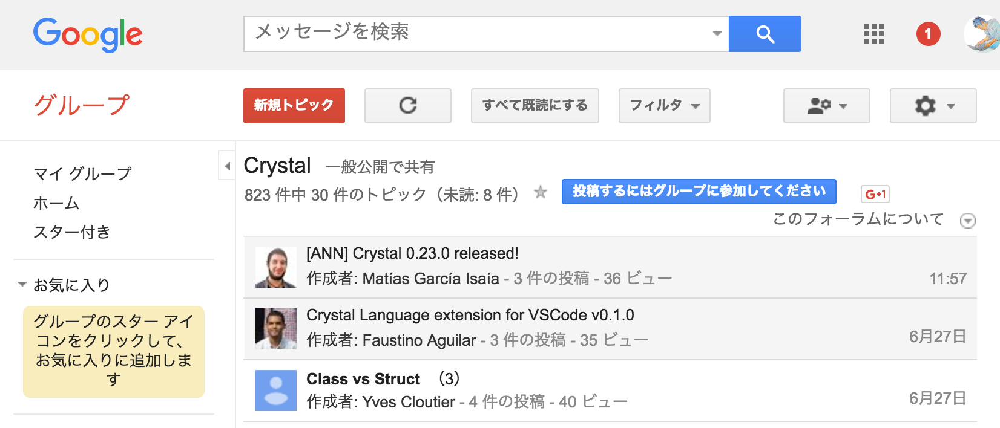


---

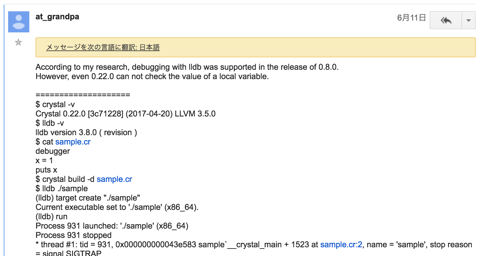

###### lldbでローカル変数の値が見れないんだけど
###### どうしたらいい？


---


###### 「Hi, grandpa」=「やぁ、おじいちゃん」


---

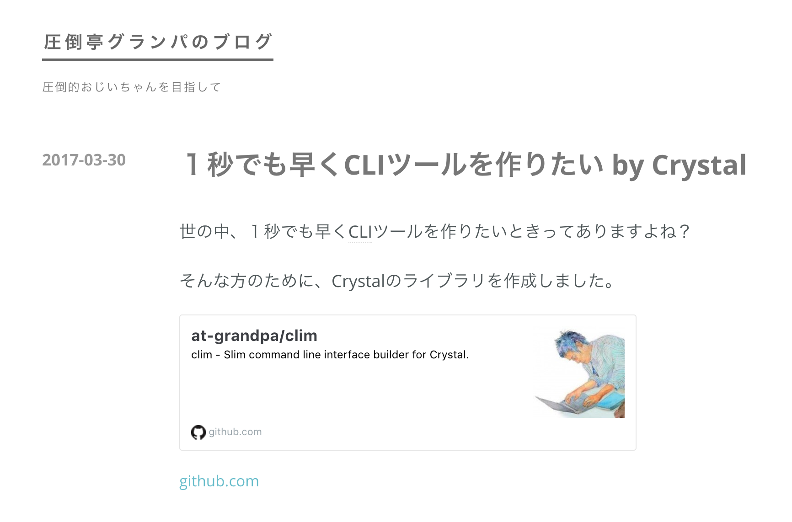

###### [１秒でも早くCLIツールを作りたい by Crystal](http://at-grandpa.hatenablog.jp/entry/clim)


---

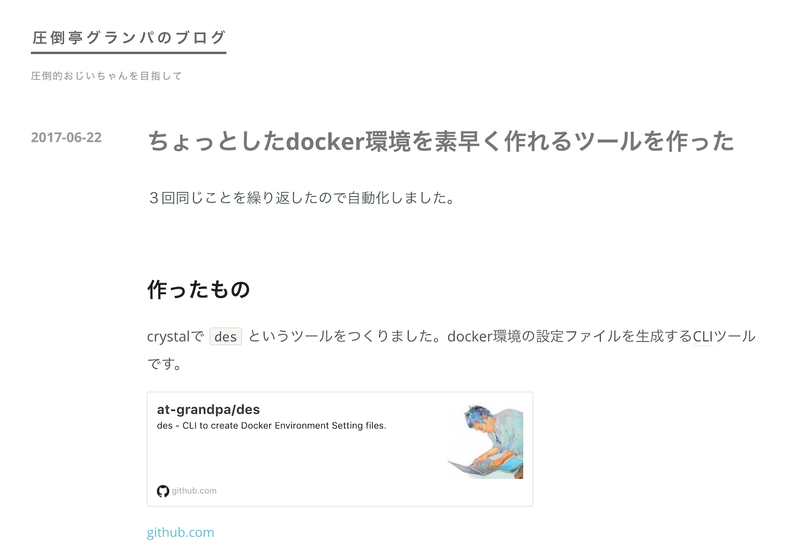

<span style="font-size: 35px;font-weight: 600;">[ちょっとしたdocker環境を素早く作れるツールを作った](http://at-grandpa.hatenablog.jp/entry/2017/06/22/090935)</span>


---

## Crystal周りの活動

- たまにissue作ったり
- たまにPR作ったり
- ライブラリ書いたり
- 勉強会開いたり
- 技術書典２で頒布したり


---

## Crystal勉強会 #4 in 渋谷

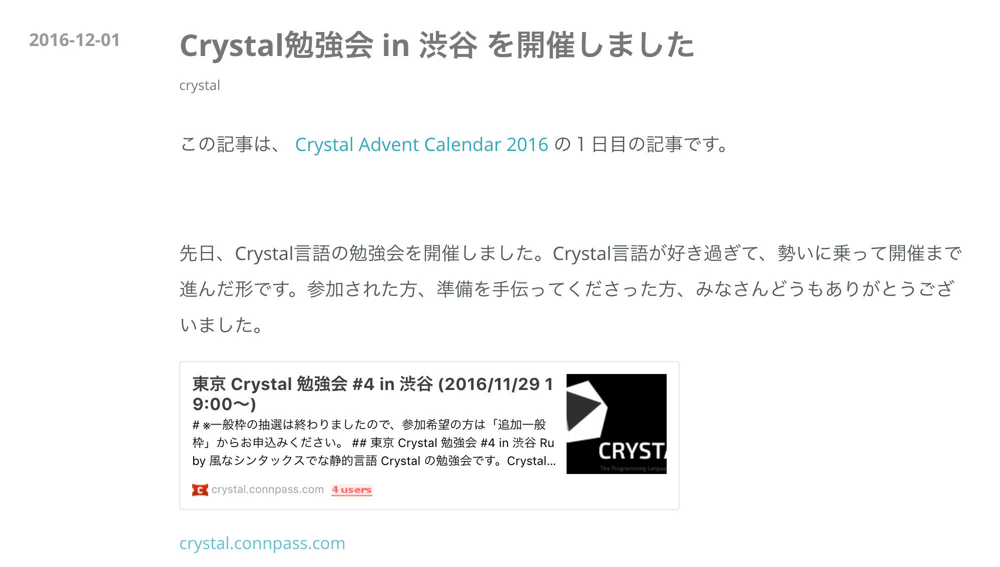

<span style="font-size: 25px;font-weight: 600;">http://at-grandpa.hatenablog.jp/entry/2016/12/01/194854</span>

---

## 技術書典２

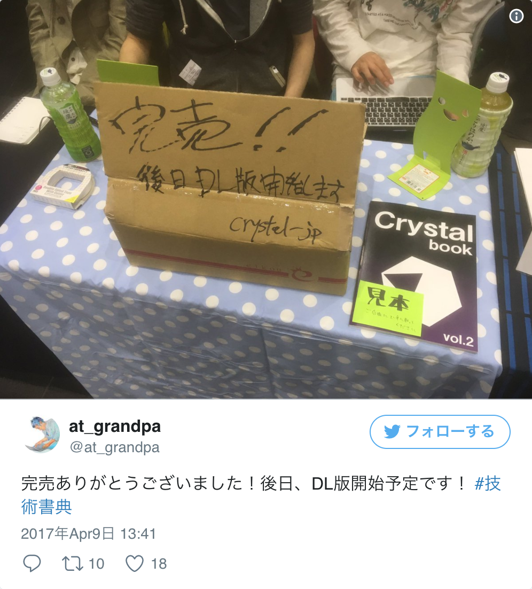


---

## 技術書典３ 開催決定 🎉

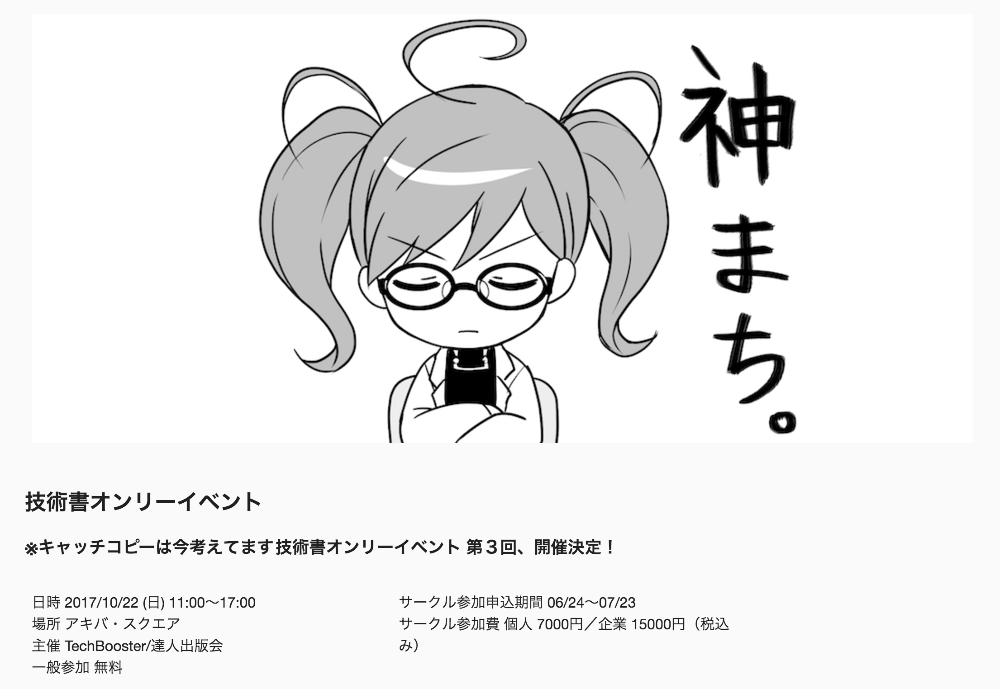

<span style="font-size: 20px;">技術書典３ - https://techbookfest.org/event/tbf03</span>


---?image=assets/images/crystal-web-site-top.png&size=cover

### Crystalのこれまでの歩みと
### v1.0 に向けたロードマップ
##### 2017.07.06 @at_grandpa


---

#### Crystalを
### ご存知の方🙋


---

### 触ったことある方🙋

+++

### ご清聴ありがとうございました🙇

---

### ライブラリを作ったことある方🙋

+++

### ご清聴ありがとうございました🙇

---

### Contributorの方🙋

+++

### ご清聴ありがとうございました🙇

---

## What language is Crystal?

---

## GOALS

- Have a syntax similar to Ruby (but compatibility with it is not a goal) |
- Statically type-checked but without having to specify the type of variables or method arguments. |
- Be able to call C code by writing bindings to it in Crystal. |
- Have compile-time evaluation and generation of code, to avoid boilerplate code. |
- Compile to efficient native code. |

<span style="font-size: 20px;">crystal-lang/crystal - https://github.com/crystal-lang/crystal/blob/master/README.md</span>

---

### Syntax

```crystal
class MyStrPrinter
  def initialize(@greeting : String = "", @name : String = "")
  end

  def print
    puts "#{@greeting}, #{@name}."
  end
end

s = MyStrPrinter.new(name: "Taro", greeting: "Hello")
s.print  # => Hello, Taro.
```
@[2-3](インスタンス変数に直接代入される)
@[10](通常の変数名を使ったキーワード引数)

---

### Short one-argument syntax

<span style="font-size: 20px;"> Blocks and Procs - https://crystal-lang.org/docs/syntax_and_semantics/blocks_and_procs.html</span>

```crystal
puts ["abc", "def", "ghi"].map do |arg|
  arg.upcase.reverse
end
# => ["CBA", "FED", "IHG"]

# ditto
puts ["abc", "def", "ghi"].map(&.upcase.reverse)
```
@[1-4](block引数が１つ & メソッド呼び出しのみ)
@[6-7](省略記法でも連続でメソッドが呼び出せる)


---

### Union types

<span style="font-size: 20px;">Union types - https://crystal-lang.org/docs/syntax_and_semantics/union_types.html</span>

```crystal
if 1 + 2 == 3
  a = 1
else
  a = "hello"
end

a      # : Int32 | String
a.to_s # => String
a + 1  # Error, because String#+(Int32) isn't defined
```
@[1-5](ifの分岐で型が異なる)
@[7](Int32 or String の型を持つ)
@[8](両型に存在するメソッドは呼べる)
@[9](片方にしか存在しないメソッドは呼べない)


---

# 😅

```
undefined method 'to_i' for Nil (compile-time type is (Array(Array(Bool | Float64 | Int32 | Int64 | MySQL::Types::Date | Slice(UInt8) | String | Time | Nil)) | Nil)) (did you mean 'to_s'?)
```

<span style="font-size: 1px;">　</span>

- 変数のスコープは小さくする |
- 変数の型を明示的に書いてしまう |

---

### Macros

<span style="font-size: 20px;">Macros - https://crystal-lang.org/docs/syntax_and_semantics/macros.html</span>

```crystal
class MacroSample
  def year
    @year
  end

  def month
    @month
  end

  def date
    @date
  end
end

# ditto
class MacroSample
  macro define_getter(*names)
    
      def {{name}}
        @{{name}}
      end
    
  end

  define_getter year, month, date
end
```
@[1-13](定型的なメソッド)
@[15-26](Macroを使ってまとめる)

---

### Generics

<span style="font-size: 20px;">Generics - https://crystal-lang.org/docs/syntax_and_semantics/generics.html</span>

```crystal
class MyBox(T)
  def initialize(@value : T)
  end

  def value
    @value
  end
end

int_box = MyBox(Int32).new(1)
int_box.value # => 1 (Int32)

string_box = MyBox(String).new("hello")
string_box.value # => "hello" (String)

another_box = MyBox(String).new(1) # Error, Int32 doesn't match String
```
@[1-8](大文字で型変数を定義)
@[10-11](Int32のオブジェクトを生成)
@[13-14](Stringのオブジェクトを生成)
@[16](型が違うとError)

---

### abstract class

<span style="font-size: 20px;">Virtual and abstract types - https://crystal-lang.org/docs/syntax_and_semantics/virtual_and_abstract_types.html</span>

```crystal
# abstract.cr
abstract class Animal
  abstract def talk
end

class Dog < Animal
end
# Error in abstract.cr:2: abstract `def Animal#talk()` must be implemented by Dog
#
#   abstract def talk
#                ^~~~
```
@[1-4](abstractメソッドを定義)
@[6-11](存在しなければError)

---

## $ crystal tool

---

### $ crystal tool context

```
$ crystal tool context -c context.cr:4:1 context.cr
1 possible context found

| Expr    | Type   |
--------------------
| a       | String |
| b       | Int32  |
| puts(a) |  Nil   |
```

- カーソル位置のスコープでの変数やメソッドの型を表示

---

### $ crystal tool hierarchy

```crystal
class Animal; end
class Cat < Animal; end
class Mike < Cat; end
```
```
$ crystal tool hierarchy hierarchy.cr -e Animal
- class Object (4 bytes)
  |
  +- class Reference (4 bytes)
     |
     +- class Animal (4 bytes)
        |
        +- class Cat (4 bytes)
           |
           +- class Mike (4 bytes)
```

- 継承関係を図で表示
- -e オプションでクラス名指定

---

### $ crystal tool format

```crystal
# before
def hoge; "hoge"; end

puts [1,2,   3  ]. map(&.   to_s)
```

```crystal
# after
def hoge
  "hoge"
end

puts [1, 2, 3].map(&.to_s)
```

---

### $ crystal tool expand

```
$ crystal tool expand -c macro.cr:10:3 macro.cr
1 expansion found
expansion 1:
   define_getter(year, month, date, hour, min, sec)

~> def year
     @year
   end
   def month
     @month
   end
   def date
     @date
   end
```

---


---

## A survey on Crystal

---

### Crystal 言語周辺の 2017年は？（妄想）

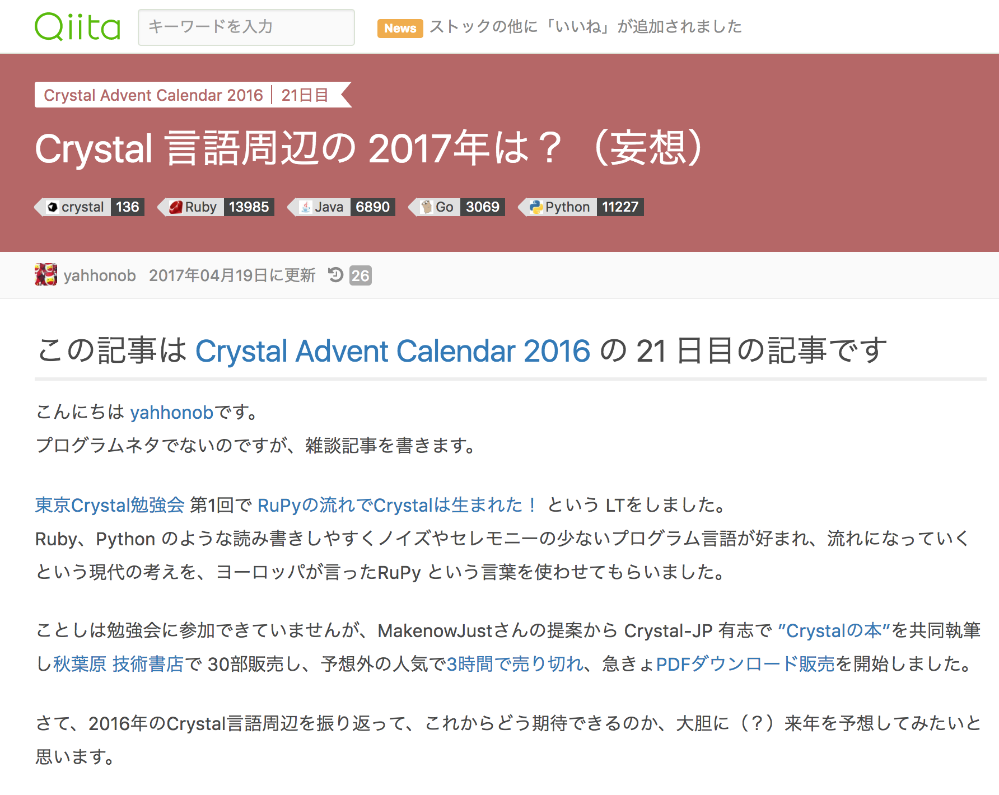

<span style="font-size: 30px;">author: [@yahhonob](https://twitter.com/yahhonob)さん</span>

<span style="font-size: 20px;">http://qiita.com/yahhonob/items/a24dee215c70425196d3</span>

---

## History of Crystal

---

###### The story behind #CrystalLang

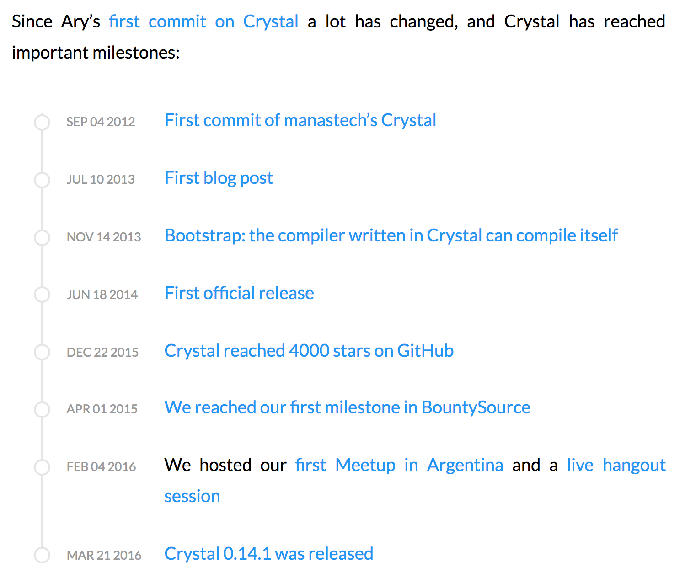

<span style="font-size: 20px;">https://manas.tech/blog/2016/04/01/the-story-behind-crystal.html</span>

---

###### Initial commit

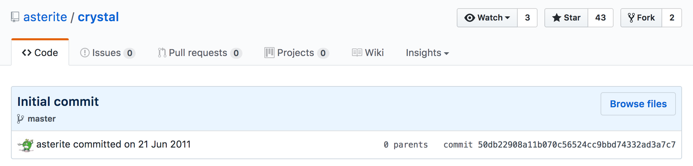

###### 2011.06.21

<span style="font-size: 20px;">https://github.com/asterite/crystal/commit/50db22908a11b070c56524cc9bbd74332ad3a7c7</span>

---

###### First blog post

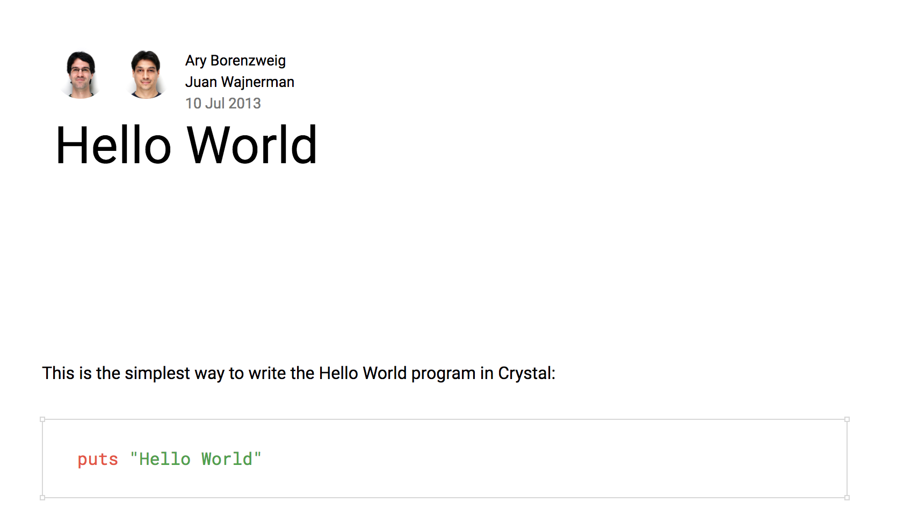

###### 2013.07.10

<span style="font-size: 20px;">https://crystal-lang.org/2013/07/10/hello-world.html</span>

---

###### The compiler written in Crystal can compile itself

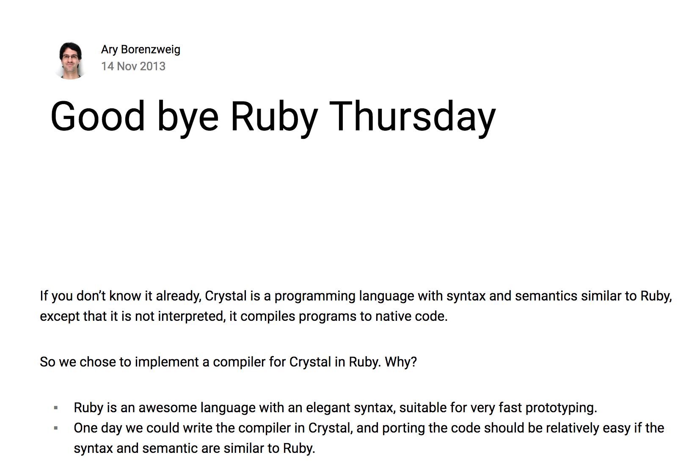

###### 2013.11.14

<span style="font-size: 20px;">https://crystal-lang.org/2013/11/14/good-bye-ruby-thursday.html</span>

---

###### First official release

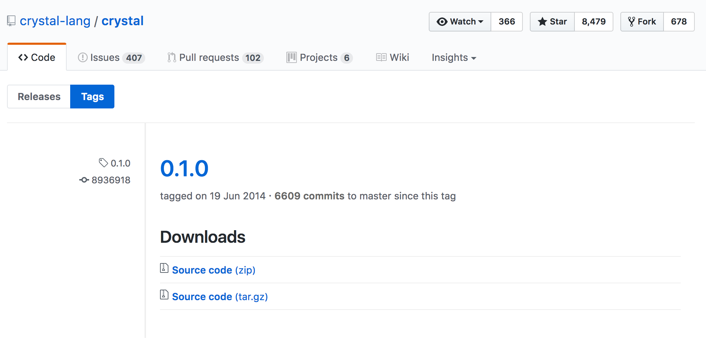

###### 2014.06.19

<span style="font-size: 20px;">https://github.com/crystal-lang/crystal/releases/tag/0.1.0</span>

---

###### Crystal reached 4000 stars on GitHub

#### 🌟 🌟 🌟 🌟

###### 2015.12.22

<span style="font-size: 20px;">https://github.com/crystal-lang/crystal/stargazers</span>

---

###### First Meetup in Argentina

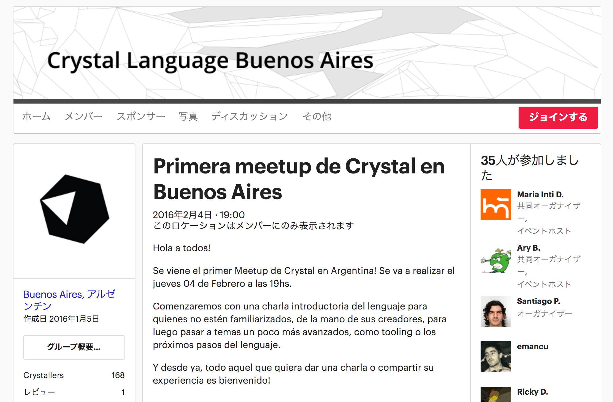

###### 2016.02.04

<span style="font-size: 20px;">https://www.meetup.com/Crystal-Language-Buenos-Aires/events/227938900/</span>


---

## Github Stars 🌟

---

### 現時点では...
### [crystal-lang/crystal](https://github.com/crystal-lang/crystal)

---

### Star数の推移を追ってみる 📈

---

### 便利なサイト
### [http://www.timqian.com/star-history/](http://www.timqian.com/star-history/)

---

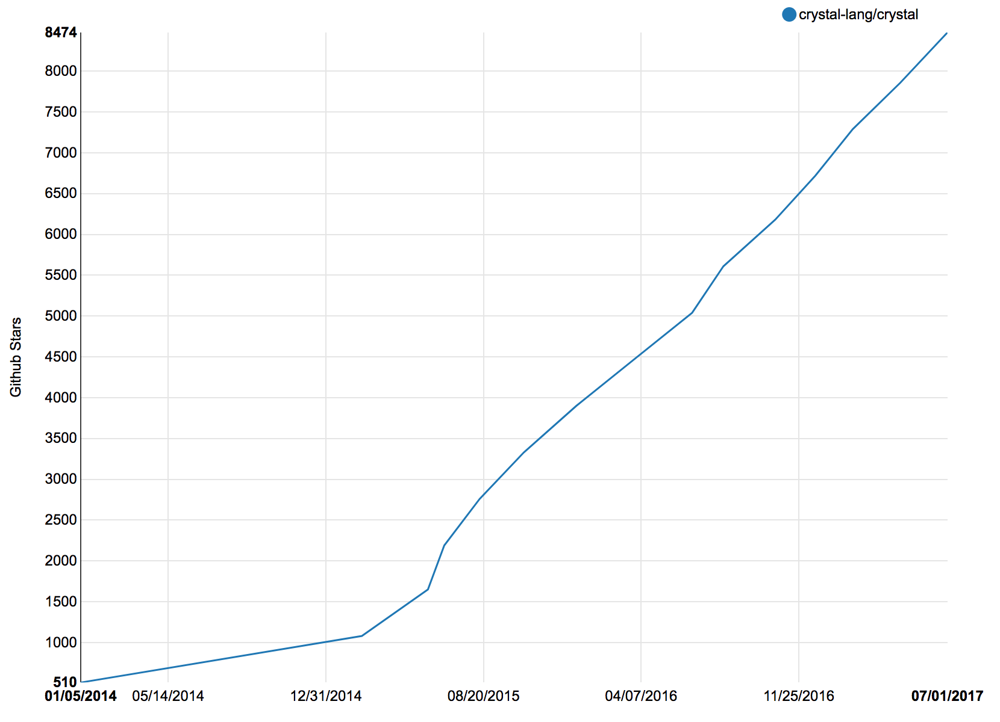

---

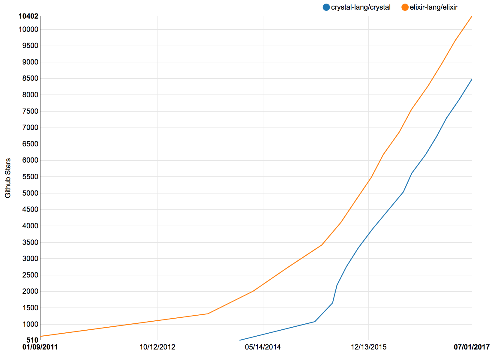

---


---

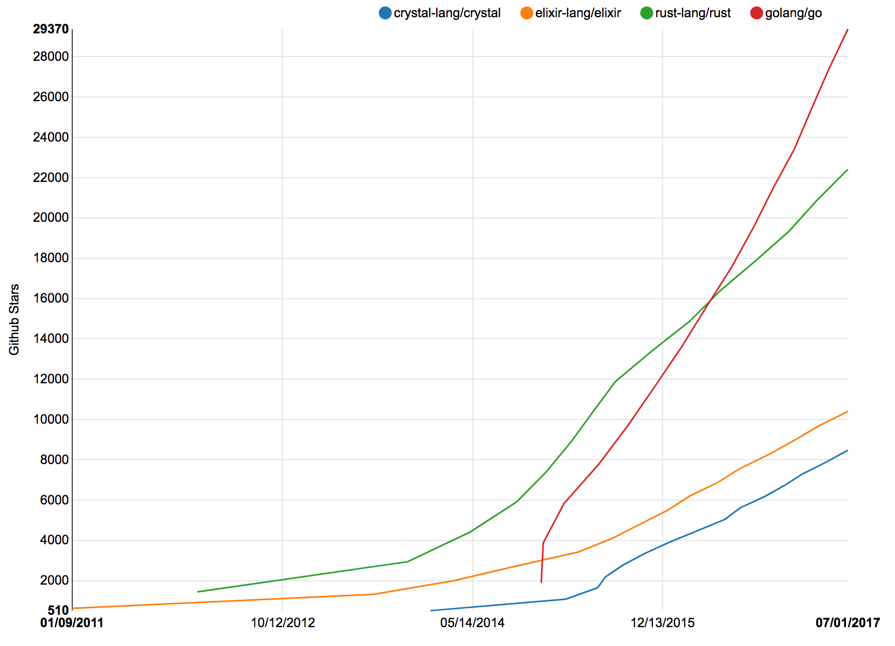

---

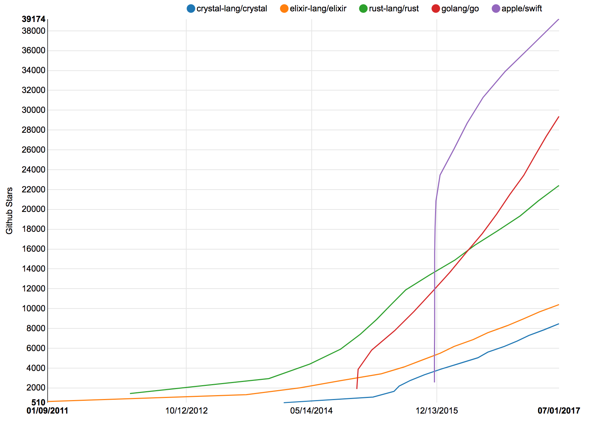

---

- 新しい世代の中では１〜２年遅れていそう |
- キラーアプリ/キラーライブラリがない |
- 実用事例が少ない |
- 触る人は徐々に増え始めている印象 |
  - 海外の CodeCamp 開催頻度
  - blogのpost数
  - twitterの投稿数
  - 新規ライブラリの登場頻度
- 日本だとちょっと下火？ |

---

### なかなか突出しないが
### 言語としては順当に成長している

---

# Library

---

### shards

- rubyの`bundler`的存在
- `shards.yml`に設定記述
- githubのリポジトリ指定
  - branchやタグ指定可能
- `shards.lock`を生成

---

###### ライブラリをinstallするまでの流れ

```
$ crystal init app kemal_test
      create  kemal_test/.gitignore
      create  kemal_test/.editorconfig
      create  kemal_test/LICENSE
      create  kemal_test/README.md
      create  kemal_test/.travis.yml
      create  kemal_test/shard.yml
      create  kemal_test/src/kemal_test.cr
      create  kemal_test/src/kemal_test/version.cr
      create  kemal_test/spec/spec_helper.cr
      create  kemal_test/spec/kemal_test_spec.cr
Initialized empty Git repository in /path/to/kemal_test/.git/
$ cd kemal_test
$ vim shard.yml
$ cat shard.yml
name: kemal_test
version: 0.1.0

authors:
  - at-grandpa

targets:
  kemal_test:
    main: src/kemal_test.cr

crystal: 0.23.0

license: MIT

dependencies:
  kemal:
    github: kemalcr/kemal
    branch: master

$ shards install
Updating https://github.com/kemalcr/kemal.git
Updating https://github.com/luislavena/radix.git
Updating https://github.com/jeromegn/kilt.git
Installing kemal (master)
Installing radix (0.3.8)
Installing kilt (0.4.0)
$ ls -1 lib
kemal
kilt
radix

$ vim src/kemal_test.cr
$ cat src/kemal_test.cr
require "./kemal_test/*"
require "kemal"

get "/" do
  "Hello World!"
end

Kemal.run

$ crystal run src/kemal_test.cr
[development] Kemal is ready to lead at http://0.0.0.0:3000
```
@[1](`Crystal init`コマンドで雛形を生成)
@[2-12](雛形が生成される)
@[13]()
@[14](`shads.yml`を編集)
@[15]()
@[16-34]()
@[30-33](`kemal`を記述)
@[35](依存ライブラリをinstall)
@[36-41](install完了)
@[42-46](libディレクトリに存在)
@[47](ソースコードを編集)
@[48]()
@[49-57](`require`できる)
@[58-59](実行できる)

---

### ライブラリを紹介しているサイト


---

### AWESOME CRYSTAL

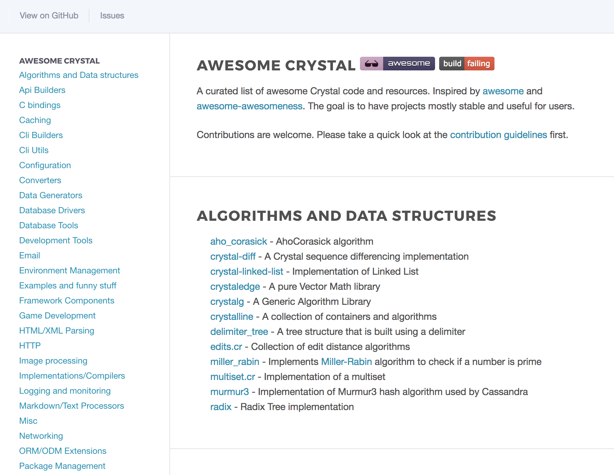

<span style="font-size: 20px;">http://awesome-crystal.com/</span>

---

### CrystalShards

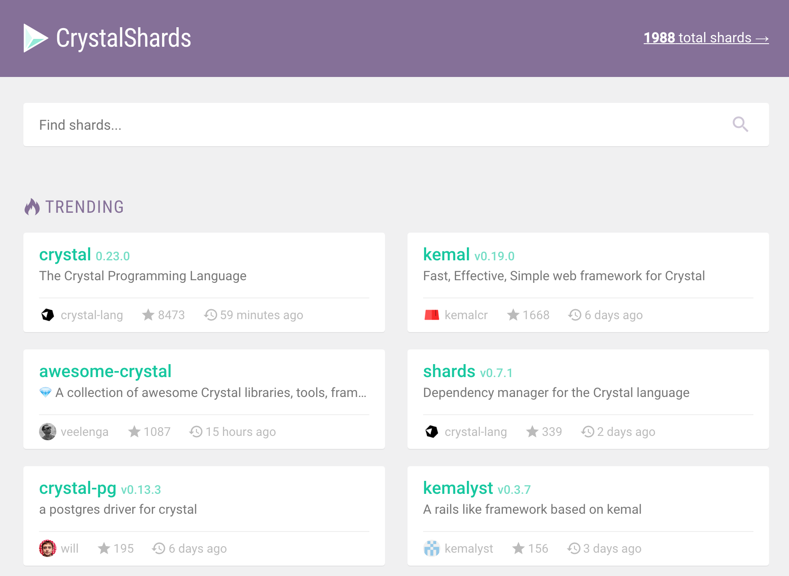

<span style="font-size: 20px;">http://crystalshards.xyz/</span>

---

### 有名どころ

- [kemal](http://kemalcr.com/)
  - Sinatraライクな web framework
- [amber](http://www.ambercr.io/)
  - Railsライクな web framework
  - CLIツールもある
- [sidekiq.cr](http://www.mikeperham.com/2016/05/25/sidekiq-for-crystal/)
  - sidekiq作者が自ら制作

---

### 注目

- [graphql-crystal](https://github.com/ziprandom/graphql-crystal)
  - まだbeta版
- [scry](https://github.com/kofno/scry)
  - LSP対応の code analysis server

---

---

## Exciting Issue or PR

---

###### What to do with global variables? #3139

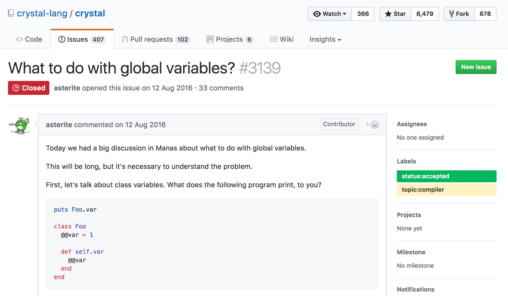

###### v0.19.0

<span style="font-size: 20px;">https://github.com/crystal-lang/crystal/issues/3139</span>

---

###### Add intro sort to Array #3514

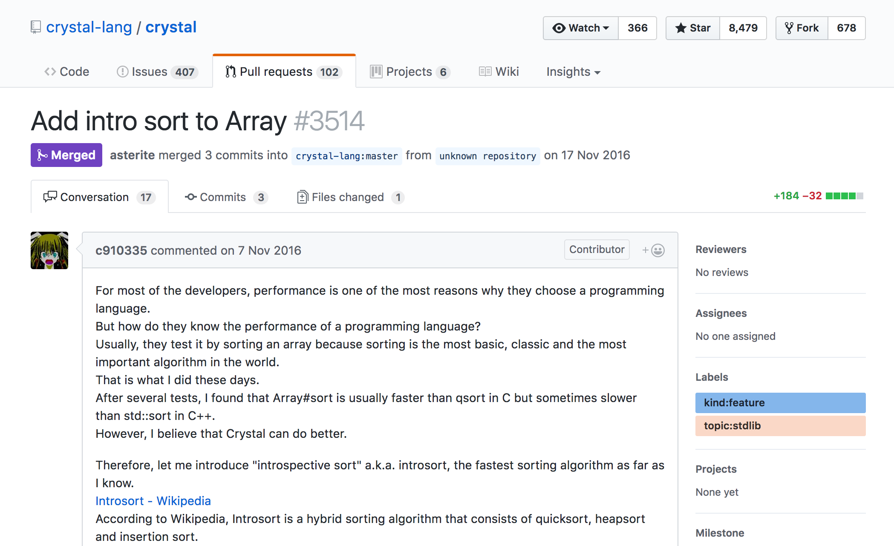

###### [Introsort - Wikipedia](https://en.wikipedia.org/wiki/Introsort)

<span style="font-size: 20px;">https://github.com/crystal-lang/crystal/pull/3514</span>

---

---

## The future of Crystal

---

###### Crystal new year resolutions for 2017: 1.0

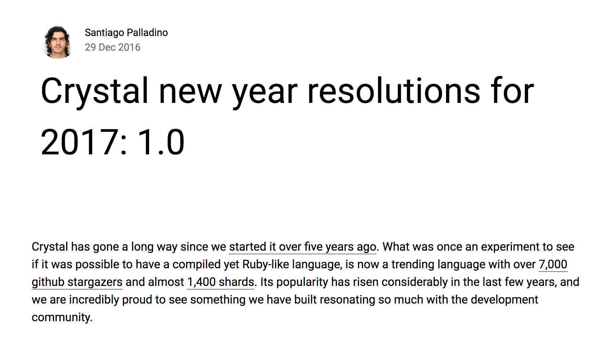

<span style="font-size: 20px;">https://crystal-lang.org/2016/12/29/crystal-new-year-resolutions-for-2017-1-0.html</span>

---

### WHAT 1.0 MEANS

The fundamental idea behind achieving a 1.0 milestone is to reach a point where breaking changes to the core of the language are down to a minimum.

---

###### THE ROAD TOWARDS A 1.0 RELEASE


---

### Parallelism

- 1.0に向けた一番大きな機能
- 既にThreadクラスはあるが、「Don't use this class」になっている
- [thread-support] branchで開発中
  - 最近コミットされていない...
- 実験的ではあるが、multithread-enabled Fibers を使用するためのWikiがある
  - [Crystal-lang wiki - Threads support](https://github.com/crystal-lang/crystal/wiki/Threads-support)

---

### Windows support

- Windowsのサポートへの期待は大きい
- Cross-platform desktop apps
- [WIP - Windows #3582](https://github.com/crystal-lang/crystal/pull/3582)
  - WindowsサポートへのRoadmap

---

### Type system

- 型推論のさらなるブラッシュアップ
- Generics周りでの再レビューに必要性がある

---

### Incremental compilation

- Crystalはコンパイル時間が遅い印象がある
  - rustやgoと比べられがち
  - redditやgoogle-groupでも話題に挙がる
- 特にMacros周りが遅い
  - コンパイル時にコードを生成しているので
- 1.0にはmustではないという認識なので、後回しになるかも

---

### Macros

- 「1.0以降でMacrosに Breaking-changes を入れたくない！」
  - AST触ったり、コンパイルプロセスにフックできたりするので
- わかる


---

### Syntax

- (Macrosと同じように)1.0以降ではSyntaxは固定する
- 今後は大きな変更はないと思うが、さらにしっかりとレビューした上で固定する

---

## How to get there


